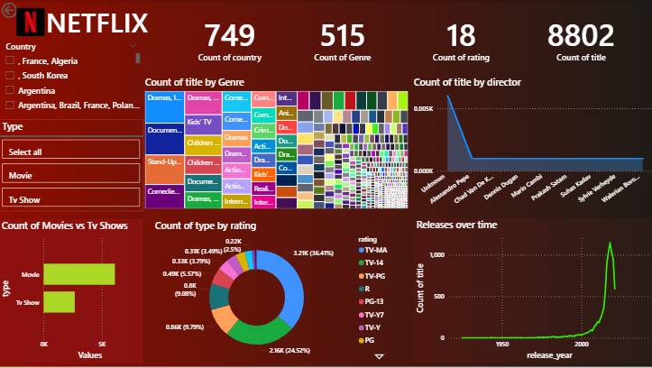

# Netflix Data Analysis Dashboard

## Project Overview
This project analyzes Netflix's global content catalog to understand trends in content production, genres, ratings, and country distribution.

SQL was used for data cleaning and querying, while Power BI was used to create an interactive dashboard.

## Tools Used
- SQL Server
- Power BI
- Excel

## Business Questions Answered
- How many movies vs TV shows exist?
- Which countries produce the most content?
- What are the most common genres?
- How has Netflix content grown over time?

## Key Insights
• TV Shows are rapidly increasing in comparison to movies  
• United States, India, and UK dominate content production  
• TV-MA and TV-14 are the most common ratings  
• Significant content growth after 2015  

## Dashboard Features
- Movie vs TV show comparison
- Content distribution by genre
- Ratings breakdown
- Releases over time
- Top directors analysis

## Dashboard Preview

## Author
Kesar Deaulkar
