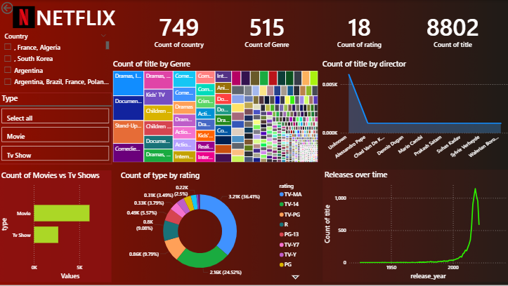

# 🎬 Netflix Content Analysis: Growth Trends & Content Strategy Insights

## 📌 Project Overview
This project analyzes Netflix's global content catalog to identify trends in content production, genre distribution, and regional contribution.

The objective is to understand how Netflix’s content strategy has evolved over time and derive insights that can support content acquisition and production decisions.

---

## 🛠 Tools & Technologies
- SQL Server (Data analysis)
- Power BI (Dashboard visualization)
- Excel (Dataset)

---

## 📊 Key Business Questions
- How has Netflix’s content library evolved over time?
- Which countries contribute most to content production?
- What genres dominate the platform?
- What ratings are most common across content types?

---

## 📈 Key Insights
- Netflix content has grown significantly after 2015, indicating rapid platform expansion  
- TV Shows are increasing at a faster rate than movies, suggesting a shift toward long-form content  
- Content production is concentrated in a few countries (USA, India, UK), indicating regional dependency  
- Mature content ratings (TV-MA, TV-14) dominate, reflecting audience preference trends  

---

## 💡 Business Recommendations
- Increase content production in underrepresented regions to diversify the catalog  
- Invest more in TV shows due to growing demand for long-form content  
- Balance content ratings to target a broader audience base  
- Expand genre diversity to reduce dependency on dominant categories  

---

## 📊 Dashboard Features
- Movie vs TV show distribution  
- Content growth trends over time  
- Country-wise content contribution  
- Genre distribution analysis  
- Ratings breakdown  
- Interactive filters  

---

## 📊 Dashboard Preview

---

## 📂 Dataset
Netflix titles dataset containing global content information including genre, country, release year, and ratings.

---

## 👤 Author
Kesar Deaulkar
